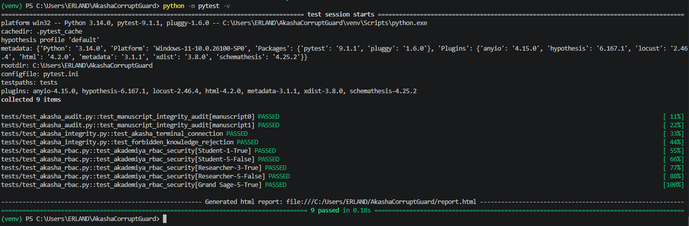
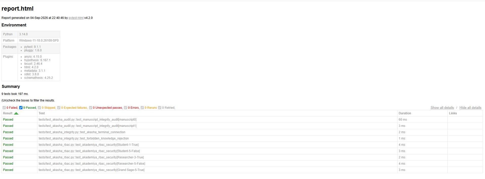

<h1 align="center">🌿 AkashaCorruptGuard</h1>
<h4 align="center">Automated Knowledge Integrity & RBAC Security QA Suite</h4>

---

## 🏛️ 1. Executive Summary

AkashaCorruptGuard is an advanced, automated Quality Assurance (QA) testing framework designed to bridge the gap between traditional Information/Library Science and modern IT security architectures. 

Built to validate the reliability of digital knowledge bases, this suite acts as a highly disciplined quality gate. It automates the detection of corrupted bibliographic data (metadata fuzzing) and strictly enforces Role-Based Access Control (RBAC) matrices. By shifting these critical checks into an automated Python-based pipeline and leveraging Cloud CI/CD, this project demonstrates a highly scalable approach to maintaining data integrity and system security in large-scale cataloging environments.

---

## 🔍 2. Problem Statement & Real-World Impact

Managing modern Online Public Access Catalogs (OPAC) and digital repositories presents severe operational risks if not properly audited:

* **Data Poisoning & Corrupted Ingestion:** Invalid metadata (e.g., malformed ISBNs, broken DDC formatting) can silently corrupt search indexes, making critical information "invisible" to users.
* **Privilege Escalation Vulnerabilities:** Without strict authorization models, a lower-tier user might bypass security endpoints to access restricted archives or system administration layers.
* **Manual Audit Fatigue:** Relying on human review for data entry and security matrices is slow, heavily prone to error, and ultimately unsustainable.

**The AkashaCorruptGuard Solution:**
This framework replaces fragile manual testing with a hermetic, automated pipeline. It simulates unauthorized access attempts and injects corrupted JSON datasets to ensure the system gracefully rejects anomalies before they ever reach the live database.

---

## ✨ 3. Core Architecture & Key Features

* **Automated CI/CD Pipeline:** Integrated with GitHub Actions to trigger continuous, automated test executions in an isolated Ubuntu cloud environment on every code push or pull request.
* **Quality Governance & Test Planning:** Guided by a formal QA strategy (`TEST_PLAN.md`) outlining risk analysis, scope, and pass/fail execution criteria.
* **Data-Driven Manuscript Integrity Audit:** Utilizes Pytest's parameterization (`@pytest.mark.parametrize`) alongside external JSON payloads to dynamically test system resilience against valid, boundary, and corrupted records.
* **Darshan RBAC Security Simulator:** An automated privilege matrix that validates access control logic across tiered clearance levels (*Student*, *Researcher*, *Grand Sage*), instantly flagging unauthorized access escalation.
* **Parallel Execution Engine:** Optimized using `pytest-xdist` to run massive test suites concurrently across multiple CPU cores, drastically reducing deployment wait times.
* **Continuous Compliance Reporting:** Automatically compiles test execution metrics, failure traces, and environment variables into a presentation-ready, standalone HTML dashboard.

---

## ⚙️ 4. Installation & Usage Guide

**Prerequisites:**
* **Python:** v3.11 or higher
* **Git:** Installed and configured

**Step 1: Clone the Repository**
<pre><code>git clone https://github.com/erlandfauzan/AkashaCorruptGuard.git
cd AkashaCorruptGuard</code></pre>

**Step 2: Set Up Virtual Environment (Recommended)**
<pre><code>python -m venv venv

# For Windows (PowerShell/CMD):
venv\Scripts\activate

# For macOS / Linux:
source venv/bin/activate</code></pre>

**Step 3: Install Dependencies**
<pre><code>python -m pip install --upgrade pip
python -m pip install -r requirements.txt</code></pre>

**Step 4: Execute Test Suite & Generate Reports**

*Option A: Standard Parallel Execution*
<pre><code>python -m pytest</code></pre>

*Option B: Execution with Interactive HTML Report*
<pre><code>python -m pytest --html=report.html --self-contained-html</code></pre>

---

## 🌿 5. Origin Philosophy & Naming Lore

In the expansive lore of *Genshin Impact*, the Akasha Terminal is a centralized, omnipresent knowledge repository created by the God of Wisdom to catalog and distribute all information across Sumeru. However, when the system is exposed to *Forbidden Knowledge*, it risks catastrophic data corruption and structural collapse. 

AkashaCorruptGuard translates this conceptual lore into a tangible software engineering project. It serves as an automated QA sentinel—guarding modern digital library ecosystems against "forbidden" (malformed) data injections and unauthorized access, ensuring the long-term resilience of the knowledge system.

---

## 📊 6. Test Execution Evidence

### 1. Automated Execution via Terminal

### 2. Interactive HTML QA Dashboard

*(The framework generates a self-contained, visually interactive dashboard (`report.html`) detailing full environment configurations and tracebacks upon every execution).*

---

## 📁 7. Repository Structure

* **`.github/workflows/test-pipeline.yml`** — CI/CD automation pipeline for Cloud execution.
* **`assets/`** — Project screenshots and documentation images.
* **`config/`** — Environment configuration variables and setup parameters.
* **`data/mock_manuscripts.json`** — The Data-Driven Testing (DDT) JSON payload acting as the automated test feed.
* **`tests/test_akasha_integrity.py`** — Validates baseline terminal API connectivity and strict anomaly rejection.
* **`tests/test_akasha_audit.py`** — The core data-driven engine testing metadata logic and filtering.
* **`tests/test_akasha_rbac.py`** — Simulates the Darshan privilege access matrices for authorization security.
* **`pytest.ini`** — Centralized Pytest configurations and HTML generation commands.
* **`requirements.txt`** — Package dependencies for seamless environment replication.
* **`TEST_PLAN.md`** — Formal software testing strategy and quality governance documentation.

---

## ⏳ 8. Architecture & Test Flow Diagram

<pre><code class="language-mermaid">graph TD
    subgraph Governance Layer ["Governance & Strategy Layer"]
        TP["Test Plan Document   TEST_PLAN.md"]
    end

    subgraph Data Layer ["Data & Configuration Layer"]
        A["JSON Mock Datasets (data/mock_manuscripts.json)"]
        B["Configuration Assets (config/ & pytest.ini)"]
    end

    subgraph Execution Layer ["QA Execution Layer"]
        C["Pytest Automated Runner (Local or GitHub Actions CI/CD)"]
    end

    subgraph Test Modules ["Security & Integrity Modules"]
        D["System Integrity Audit (test_akasha_integrity.py)"]
        E["Data-Driven Fuzzing (test_akasha_audit.py)"]
        F["RBAC Security Matrices (test_akasha_rbac.py)"]
    end

    subgraph Reporting Layer ["Continuous Reporting Layer"]
        G["Real-time Terminal Logs"]
        H["Interactive HTML Dashboard (report.html)"]
    end

    TP --> C
    A --> C
    B --> C
    C --> D
    C --> E
    C --> F
    D --> G
    E --> G
    F --> G
    G --> H
</code></pre>